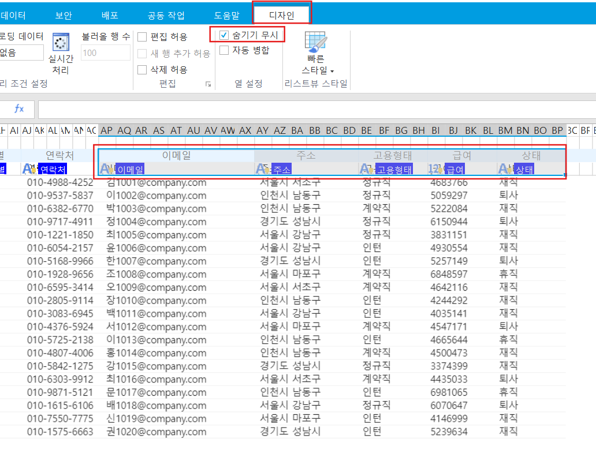
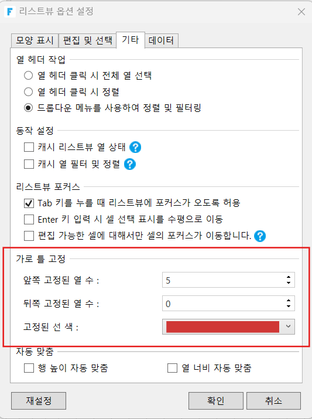
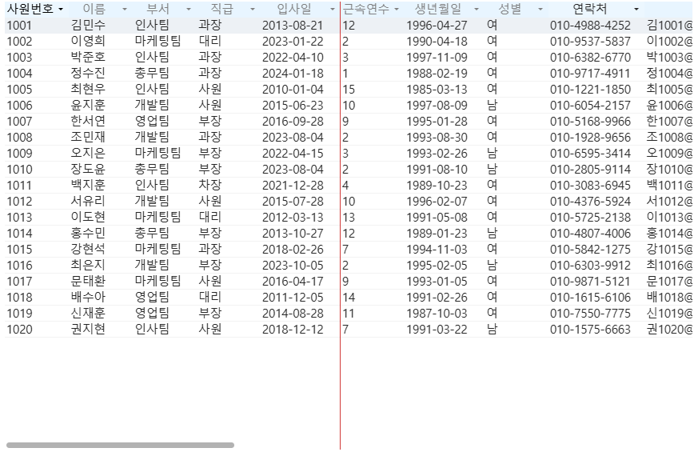

# 좌우로 스크롤 가능한 리스트뷰

리스트뷰에서 열을 정의할 때는, 그 모든 열의 크기만큼의 리스트뷰 영역이 필요하기 때문에, 일반적으로 실행 시점(runtime)에서는 열을 표시하기 위해 가로 스크롤을 사용할 필요가 없습니다.

따라서 많은 열을 실행 화면에서 표시하고 싶다면 리스트뷰의 너비를 매우 크게 만들어야 합니다.

<figure><figcaption></figcaption></figure>

<figure><figcaption></figcaption></figure>

### 리스트뷰를 좌우로 스크롤할 수 있도록 하기

리스트뷰의 표시 너비를 줄이면서 많은 열을 가로 스크롤로 표시하고 싶다면, 열 숨기기 기능과 리스트뷰의 ‘숨기기 무시’ 설정을 함께 사용하면 됩니다.

1. **열 머리글 AP열부터 BP열까지를 드래그하여 선택한 다음, 마우스 오른쪽 클릭 메뉴에서 \[숨기기]를 선택합니다.**\
   단, 가장 오른쪽 열 BS열은 숨기지 않도록 주의해야 합니다.\
   리스트뷰의 가장 오른쪽 열은 애플리케이션 실행 시 리스트뷰의 외곽선을 그리는 데 필요하기 때문입니다.

<figure><figcaption></figcaption></figure>

2. **AP2 셀부터 BP3 셀까지 선택한 다음, 리스트뷰 도구 \[디자인] 탭에서 \[숨기기 무시] 옵션을 체크하세요.**

<figure><figcaption></figcaption></figure>

3. **빌더를 실행 후, 화면을 확인해주세요.**

<figure><figcaption></figcaption></figure>

### 가로 틀 고정

가장 왼쪽 또는 가장 오른쪽의 열을 고정하여, 해당 열들이 스크롤에 포함되지 않도록 설정할 수 있습니다. 즉, 특정 열을 스크롤 대상에서 제외하고 고정 시킬 수 있습니다.

1. **리스트뷰에서 마우스 오른쪽 클릭 후, \[리스트뷰 세부 옵션]을 선택해주세요.**

<figure><figcaption></figcaption></figure>

2. **\[기타] 탭 - \[가로 틀 고정] 에서 필요한 설정을 해줍니다.**\
   아래 예시에서는 \[앞쪽 고정된 열 수]를 5로 설정하고, \[고정된 선 색]을 통해 고정된 열의 테두리 색상을 변경했습니다.

<figure><figcaption></figcaption></figure>

3. **빌더를 실행 후, 화면을 확인해주세요.**

<figure><figcaption></figcaption></figure>
