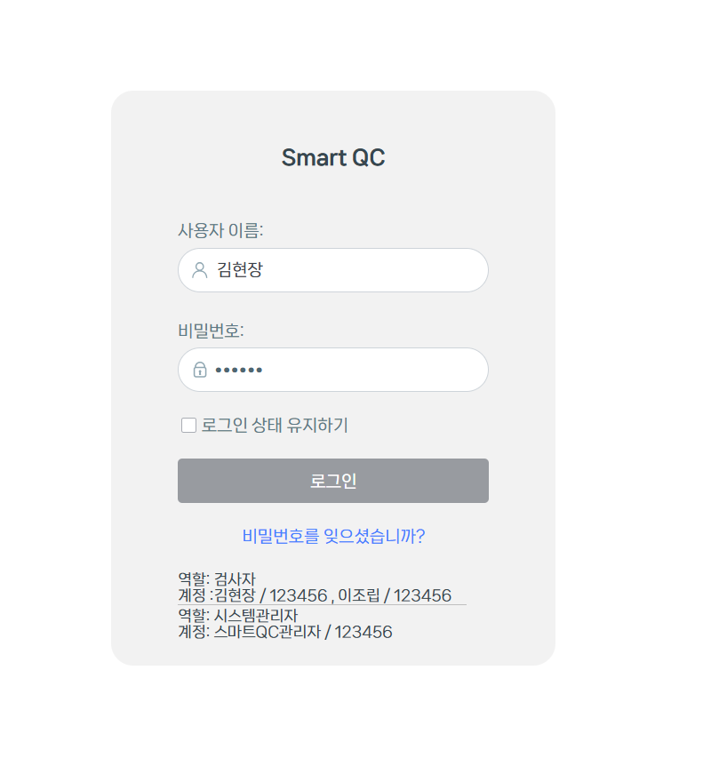

# 계정 2단계 인증 설정

포건시의 서버관리자에서는 인증의 보안을 강화하기 위해 2단계 인증을 설정할 수 있습니다.

\[설정-> 비밀번호 정책 설정]을 선택하여 계정 보안 설정 페이지로 이동합니다.

&#x20;2단계 인증은 비활성화된 상태입니다.

<figure><figcaption></figcaption></figure>

사용 또는 강제 시행을 클릭한 후 인증자 APP 계정 및 신뢰할 수 있는 장치 유효 일 수를 설정해야 합니다.

<figure><figcaption></figcaption></figure>

* 인증자 APP 계정: 인증자 APP 계정에 표시되는 이름입니다.
* 신뢰할 수 있는 장치 유효 일 수: 신뢰할 수 있는 장치가 유효한 일 수이며 기본값은 90입니다. 사용자가 장치를 신뢰하지 못하도록 하려면 유효 날짜를 0으로 설정할 수 있습니다.

2단계 인증을 사용하도록 설정하면 인증 모드가 일반 인증인 버전 7.0 이상을 사용하는 모든 앱 및 서버관리자에 대한 로그인에 대해 2단계 인증이 사용됩니다.

Windows 도메인 인증, 타사 사용자 통합 및 단일 사인온 앱은 2단계 인증을 지원하지 않습니다.

설정이 완료되면 설정 저장을 클릭합니다.

## 2단계 인증을 사용하도록 설정&#x20;

2단계 인증 상태가 강제 시행인 경우 모든 사용자는 기본적으로 2단계 인증을 켭니다.

2단계 인증 상태가 사용인 경우 관리자는 사용자 목록에서 사용자가 2단계 인증을 사용하도록 설정할지 여부를 구성해야 합니다.

사용자 목록에서 사용자의 행 오른쪽을 클릭합니다.

.png>)

계정 보안 설정 대화 상자가 나타나고 사용을 클릭하면 활성화를 확인하는 프롬프트 상자가 나타납니다.

확인을 클릭하면 해당 사용자의 2단계 인증이 시작됩니다.

.png>)

2단계 인증을 사용하도록 설정하면 계정 보안 설정 페이지에서 2단계 인증을 비활성화할 수 있습니다.

\[꺼짐] 클릭합니다.

.png>)

2단계 인증을 사용하여 로그인한 후 계정 보안 설정 페이지에서 인증자 APP를 재설정하고 신뢰할 수 있는 장치를 비울 수 있습니다.

\[꺼짐]/\[모두 무효화하기] 버튼을 클릭합니다.

## 로그인하기&#x20;

설정을 저장한 후 버전 7.0 이상을 사용하고 인증 모드가 일반 인증인 앱 및 관리 콘솔에 다시 로그인할 때 2단계 인증이 사용됩니다.

예를 들어 관리 콘솔에 로그인하여 2단계 인증이 활성화된 후의 로그인 단계를 설명합니다.

1.  서버관리자의 로그인 페이지에서 사용자 이름과 암호를 입력하고 로그인 버튼 클릭합니다. 

    <figure><figcaption></figcaption></figure>
2.  2단계 인증 페이지에서 휴대폰의 인증자 앱을 사용하여 계정을 추가하고 QR 코드를 스캔합니다. QR 코드를 스캔하면 휴대폰에 6자리 숫자가 표시됩니다.\
     

    <figure><figcaption></figcaption></figure>
3.  다음을 클릭하여 입력 상자에 인증자 APP에 표시되는 인증 코드를 입력합니다.\
    참고로   예제에서는MS Authenticator를 사용하였습니다.   

    <figure><figcaption></figcaption></figure>

이 장치에서 더 이상 묻지 않음 체크박스 선택하면 다음에 동일한 장치의 동일한 브라우저에서 2단계 확인 단계가 무시됩니다.

4. 확인을 클릭하여 성공적으로 로그인합니다.

