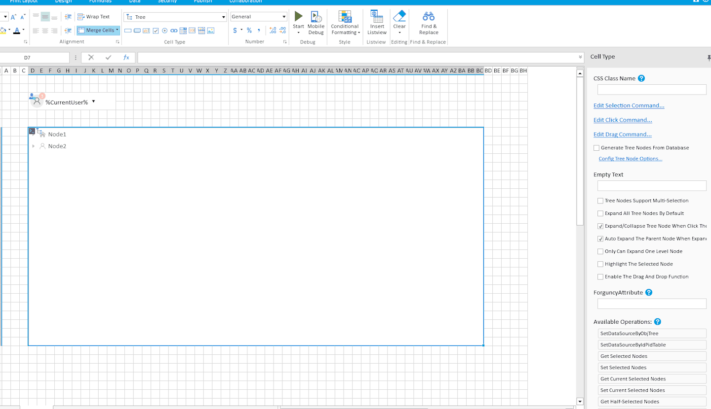
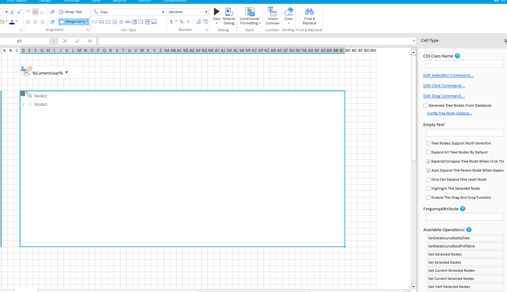
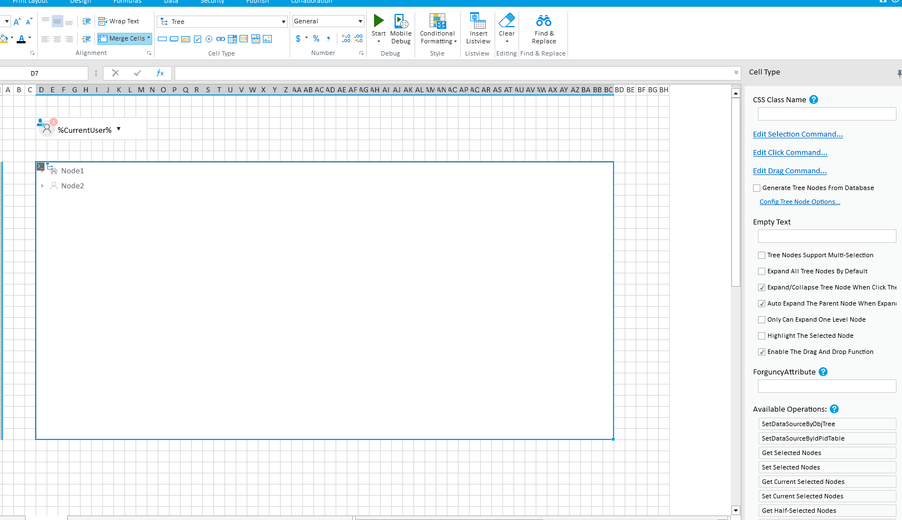
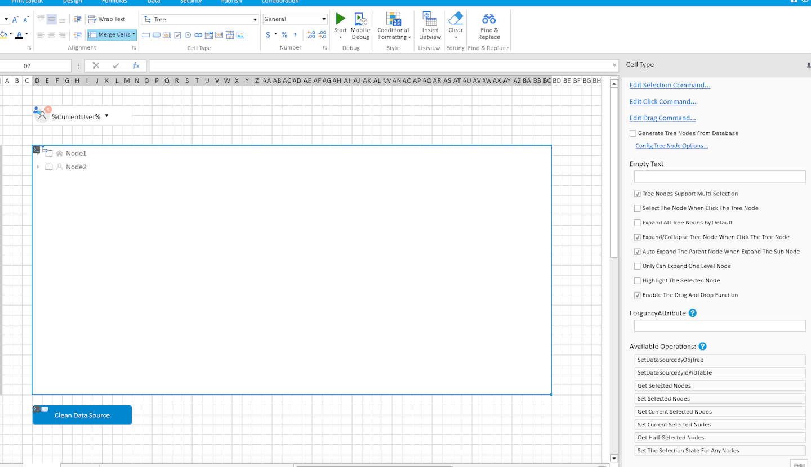
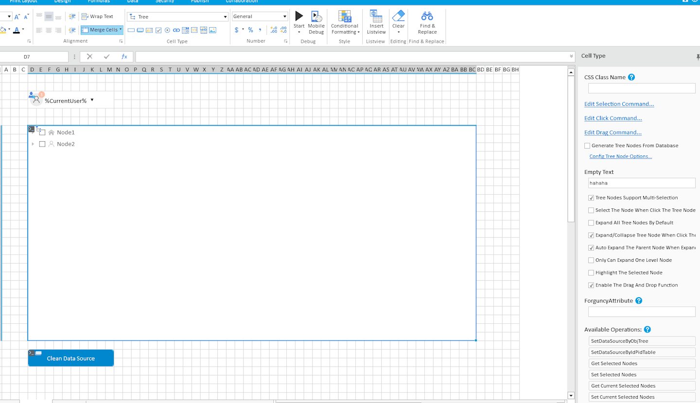
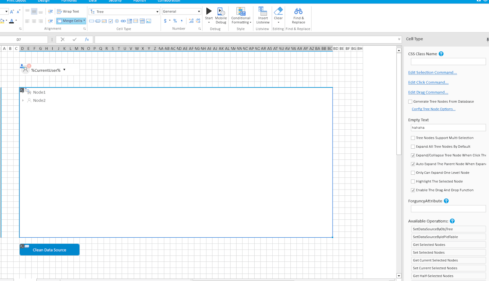
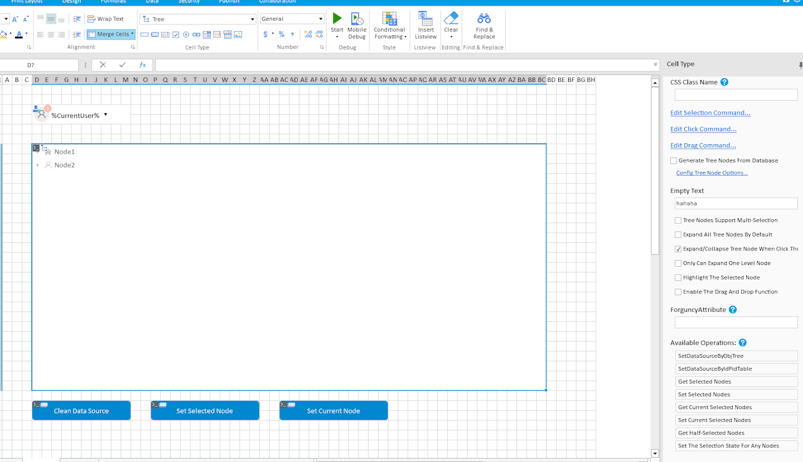

# Tree

Tree 셀유형은 **노드 끌어서 놓기** 및 **다중 선택** 기능을  제공 합니다.&#x20;

<figure><figcaption></figcaption></figure>

트리 컨트롤은 **3개의 명령** , **9개의 속성** , **7개의 사용 가능한 옵션을 제공합니다.**

<figure><figcaption></figcaption></figure>

### 명령&#x20;

일반 CellType과 비교해 트리 구성 요소는 노드를 끌 때 발생하는 작업(정렬 규칙 수정, 노드 폴더 이동 등)을 지원하기 위해 추가적인 **편집 끌기 명령을 제공합니다.** 

<table><thead><tr><th width="141">명령 </th><th>설정 </th><th>예제 사용 </th></tr></thead><tbody><tr><td>Edit Selection Command</td><td>
선택한 노드가 변경될 때마다 트리거됩니다.

지원 매개변수:
<ul><li>Value : 노드의 값</li><li>레이블: 노드의 표시 레이블</li><li>ParentValue: 부모 노드의 값</li></ul></td><td></td></tr><tr><td>Edit Click Command</td><td>
노드를 클릭할 때마다 트리거됩니다.

지원 매개변수:
<ul><li>Value : 노드의 값</li><li>레이블: 노드의 표시 레이블</li><li>ParentValue: 부모 노드의 값</li></ul></td><td></td></tr><tr><td>Edit Drag Command</td><td>
드래그 노드가 놓일 때마다 트리거됩니다.

지원 매개변수:
<ul><li>DraggingNodeValue: 드래그 노드의 값</li><li>DropNodeValue: 드롭 대상 노드의 값</li><li>
DragType: 드래그 유형
<ul><li>"before"는 드래그 노드가 드롭 노드 위에 있음을 의미합니다.</li><li>"inner"는 드래그 노드가 드롭 노드 내부에 있음을 의미합니다.</li><li>"after"는 드래그 노드가 드롭 노드 아래에 있음을 의미합니다.</li></ul></li></ul></td><td></td></tr></tbody></table>

#### 속성 

<table><thead><tr><th width="144">속성 </th><th width="296">설명 </th><th>예제사용 </th></tr></thead><tbody><tr><td>데이터 소스</td><td>
데이터 소스에는 두 가지 유형의 구성 전략이 있습니다.
<ul><li>첫 번째 유형은 다른 컨트롤과 비슷한 일반 바인딩이며 트리 노드 아이콘에 대한 추가 구성이 가능합니다.</li><li>두 번째 유형은 데이터 소스 바인딩으로, ID-PID 형식의 테이블에 데이터 바인딩을 허용합니다. 바인딩된 데이터 소스의 구성에서 향후 편리한 사용을 위해 추가 사용자 정의 매개변수를 구성할 수 있습니다.</li></ul></td><td>

 데이터 소스 일반 설정   데이터 소스 바인딩 모드
</td></tr><tr><td>Empty text</td><td>트리 데이터 소스에 데이터가 없을 때 표시되는 콘텐츠입니다.</td><td></td></tr><tr><td>Tree Nodes Support Multi Selection</td><td>
트리 노드의 다중 선택을 활성화 또는 비활성화합니다.

기본값 : 비활성화
</td><td></td></tr><tr><td>Select The node When Click The Tree Node</td><td>
이 옵션이 활성화되어 있으면 트리 노드의 라벨을 클릭해도 체크박스가 선택됩니다.

기본값 : false

참고: 이 속성은 다중 선택 모드가 활성화된 경우에만 적용됩니다.
</td><td></td></tr><tr><td>Expand All Tree Nodes By Default</td><td>
이 옵션을 활성화하면 모든 노드가 기본적으로 확장됩니다.

기본값 : false
</td><td></td></tr><tr><td>Expand/Collapse Tree Node When Click The Tree Node</td><td>
이 옵션이 활성화되어 있으면 트리 노드의 라벨을 클릭하면 확장되거나 축소됩니다. 비활성화되어 있으면 왼쪽에 있는 확장/축소 아이콘만 클릭하면 확장되거나 축소됩니다.

기본값 : true
</td><td></td></tr><tr><td>Only Can Expand One Level Node </td><td>
이 옵션을 활성화하면 한 번에 한 단계의 트리만 확장할 수 있습니다.

기본값 : false
</td><td></td></tr><tr><td>Highlight The Selected Node</td><td>
이 옵션을 활성화하면 선택된 트리 노드의 배경색이 강조 표시됩니다.

기본값 : false
</td><td></td></tr><tr><td>Enable The Drag And Drop Function</td><td>
이 옵션을 활성화하면, 트리 노드를 끌 수 있으며, 끌기 작업이 완료된 후 노드 끌기 이벤트가 트리거됩니다.

기본값 : false
</td><td></td></tr></tbody></table>
