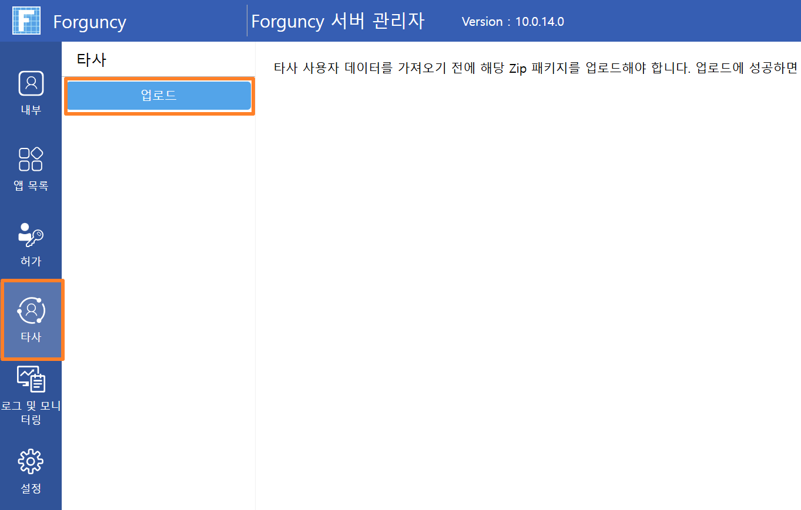

# 트리 메뉴

트리 메뉴 디렉토리 구조나 도, 도시 쿼리에 주로 사용되며 메뉴 플러그인과 마찬가지로 전체 웹사이트의 분류 및 구조를 보다 명확하게 할 수 있어 더욱 편리합니다.  이 섹션에서는 트리 플러그인의 사용을 소개합니다.

### 사용 방법&#x20;

1. 플러그인을 다운로드합니다.
2. Forguncy Builder에서 설치하고 Forguncy Builder를 다시 실행합니다.
3. 셀 범위를 선택하고 해당 셀 유형을 트리 메뉴로 설정합니다.

<figure><figcaption></figcaption></figure>

4\. 속성 설정 영역의 "셀 설정" 탭에서 트리 메뉴 설정합니다.

| 설정         | 설명                                                                                                                                                                                                                                                                                                |
| ---------- | ------------------------------------------------------------------------------------------------------------------------------------------------------------------------------------------------------------------------------------------------------------------------------------------------- |
| 트리 편집 명령   | 트리 노드를 클릭할 때 실행할 명령을 설정합니다.                                                                                                                                                                                                                                                                       |
| 트리 항목 구성   | 
1. 데이터베이스 바인딩 없음: 트리 노드의 이름과 값을 사용자 정의하고 전달할 수 있습니다.  노드를 추가, 빼기, 위아래로 이동합니다. 2. 바인딩 데이터베이스: 바인딩 트리 노드를 편집하고 바인딩 모드를 고정 수준 모드 또는 동적 수준 모드로 선택하고 속성 설정, 쿼리 설정 및 정렬 설정을 수행합니다.
 |
| 기본 접기/펼치기  | 모두 확장 또는 모두 축소.                                                                                                                                                                                                                                                                                   |

### 데이터소스를 활용한 트리 메뉴 구성하기



1. 계층 구조를 위한 데이터 테이블 생성 트리 메뉴의 상하 관계(부모-자식)를 표현하기 위해 아래와 같이 테이블을 설계합니다.
   * ID: 각 메뉴 항목의 고유 번호입니다.
   * 연동ID (Parent ID): 해당 항목이 속한 상위 메뉴의 ID를 입력합니다. (최상위 메뉴일 경우 비워둡니다.)
   * 메뉴명: 화면에 표시될 메뉴의 이름입니다. 

<figure><figcaption></figcaption></figure>

2.  페이지에 셀 영역을 선택한 후, 셀 유형에서 트리 메뉴를 선택합니다. 

    <figure><figcaption></figcaption></figure>
3. 페이지에서 트리 메뉴 셀을 선택 한 후, 우측 트리 항목 구성에서 "데이터베이스에서 데이터 연결"에 체크하고 \[DB연동 트리 구성 편집]을 클릭합니다.\
   .png>)
4.  작성한 데이터 테이블을 트리 메뉴에 표시하기 위해 \[데이터 연동 모드]를 "동적 계층"으로 설정합니다. 아래의 각 속성 설정을 참고하여 필드를 매핑해 주세요.

    * 테이블: 메뉴 데이터가 저장된 테이블(예: '메뉴')을 선택합니다.
    * 데이터 필드: 각 메뉴 항목을 식별할 고유 값인 \[ID] 필드를 선택합니다.
    * 표시 필드: 사용자에게 실제로 보여줄 텍스트인 \[메뉴명] 필드를 선택합니다.
    *   연동된 상위 계층 필드: 메뉴의 부모-자식 관계를 결정하는 \[연동ID] 필드를 선택합니다.

        > 💡 설명: 이 설정이 완료되면, Forguncy는 '연동ID'에 적힌 번호를 찾아 자동으로 계층 구조(Depth)를 생성합니다.

    <figure><figcaption></figcaption></figure>
5.  메뉴 항목을 클릭하면 해당 페이지로 이동할 수 있도록 \[트리 편집 명령]을 클릭합니다. \
    명령 창에서 조건에 맞는 페이지가 나오도록 설정합니다. 

    <figure><figcaption></figcaption></figure>

자세한 사항은 첨부한 샘플을 확인해주시기 바랍니다.
